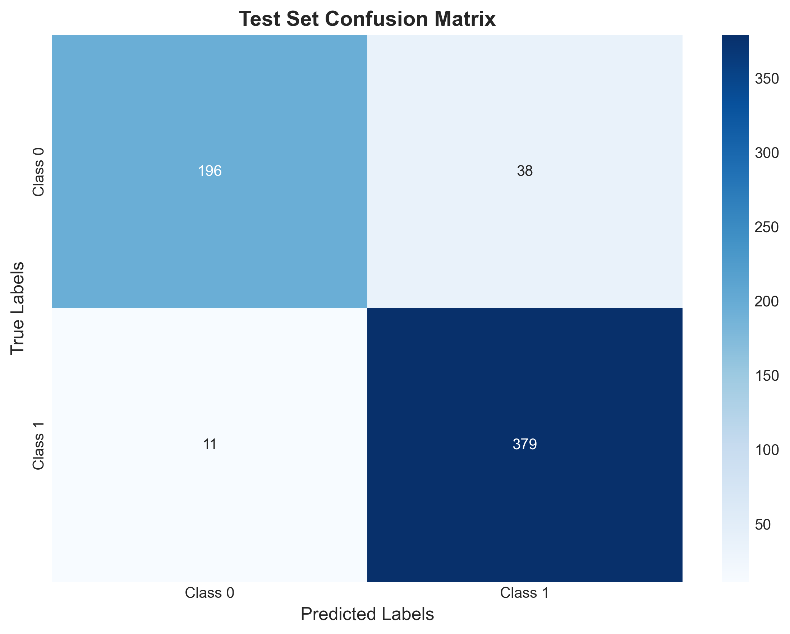
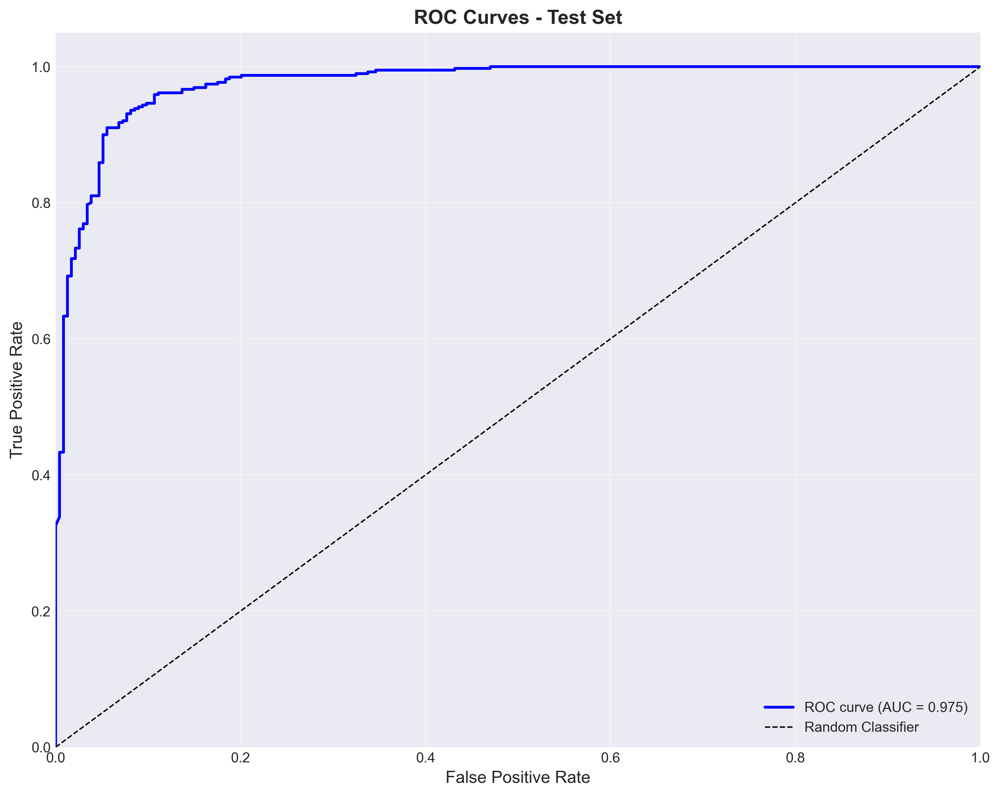
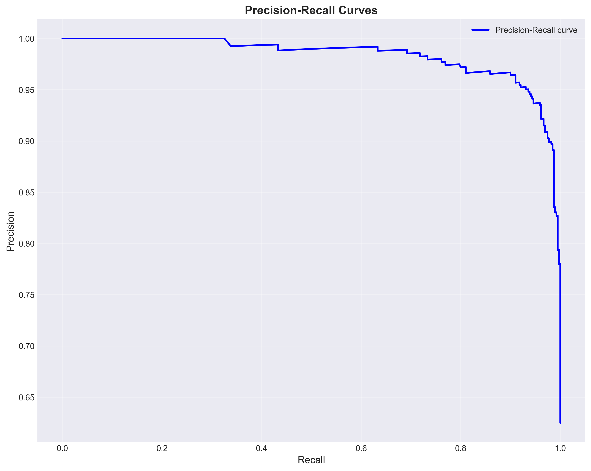
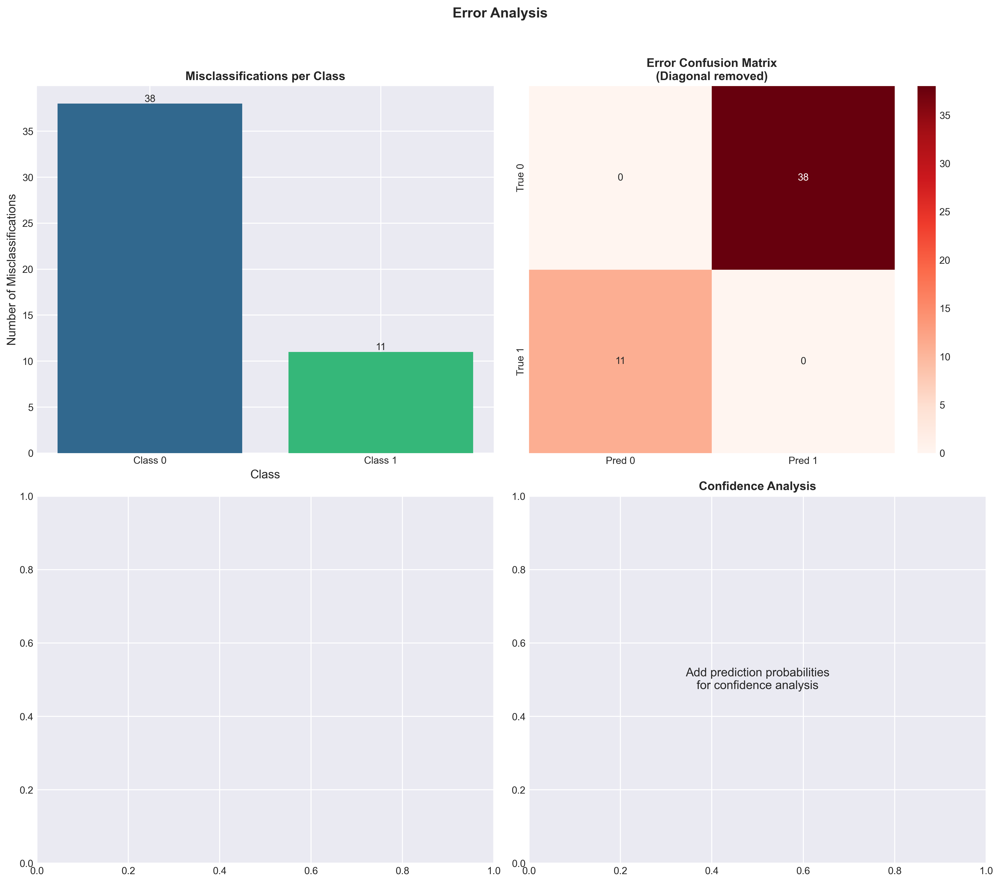
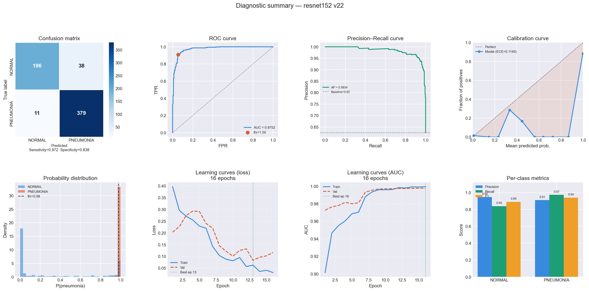
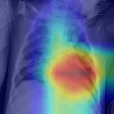

# 🫁 Pneumonia Detection from Chest X-Rays

A deep learning pipeline for detecting pneumonia in pediatric chest X-rays, built with PyTorch. The project trains and compares a custom CNN against a fine-tuned ResNet152, includes GradCAM explainability, a full experiment-tracking system, a CLI inference demo, and a live web demo deployed on Streamlit Cloud + Hugging Face.

**🔗 Live demo:** [pneumoniadetection-demo.streamlit.app](https://pneumoniadetection-demo.streamlit.app/)

> ⚠️ This is a research/portfolio project, not a diagnostic tool. Do not use it to make real medical decisions.

---

## Table of Contents

- [Overview](#overview)
- [Results](#results)
- [Project Structure](#project-structure)
- [Dataset](#dataset)
- [Setup](#setup)
- [Usage](#usage)
- [Explainability (GradCAM)](#explainability-gradcam)
- [Experiment Tracking](#experiment-tracking)
- [Web Demo](#web-demo)
- [Key Engineering Decisions](#key-engineering-decisions)
- [License](#license)

---

## Overview

Chest X-rays are one of the most common tools for diagnosing pneumonia, but manual interpretation is time-consuming and prone to inter-observer variability. This project explores whether a CNN can flag pneumonia cases reliably enough to be useful as a triage aid, while being transparent about *where* the model is looking via GradCAM.

Two architectures were trained and compared:

- **Custom CNN** (`module.py::improved_cnn`) — a 4-block convolutional network built from scratch (BatchNorm + Dropout + global average pooling), trained end-to-end on grayscale X-rays.
- **ResNet152 (transfer learning)** (`transfer_training_code/resnet152.py`) — an ImageNet-pretrained ResNet152 with a custom classification head, fine-tuned in two phases (FC-only, then FC + `layer3` + `layer4`).

Both models are trained with class-weighted loss to handle the dataset's class imbalance, and evaluated using a **clinically-tuned decision threshold** (optimized on the validation set for high precision) rather than the naive 0.5 cutoff.

## Results

Final numbers below are from the best ResNet152 run (`resnet152 v22`) on the held-out test set, at the tuned clinical threshold.

| Metric | Score |
|---|---|
| Accuracy | 92.1% |
| ROC-AUC | 0.975 |
| F1 (weighted) | 0.920 |
| MCC | 0.832 |
| Sensitivity (Recall, PNEUMONIA) | 97.2% |
| Specificity (Recall, NORMAL) | 83.8% |
| Precision (PNEUMONIA) | 90.9% |
| Precision (NORMAL) | 94.7% |

The model prioritizes **sensitivity** — catching true pneumonia cases — over specificity, which is the appropriate trade-off for a screening tool where missing a positive case is more costly than a false alarm.

<table>
<tr>
<td></td>
<td></td>
</tr>
<tr>
<td></td>
<td></td>
</tr>
</table>

**Full training diagnostics** (loss curves, AUC curves, calibration, per-class breakdown) for the ResNet152 run:



A note on the train/val vs. test loss gap: best validation loss was ~0.08 while test loss came in around ~0.57 with AUC staying high. This isn't a bug — Kaggle's `test` split for this dataset is a separately curated, differently-distributed set of images from `train`/`val`, a known quirk of this dataset. The 0.98 clinical threshold is intentionally set high for comparability with published benchmarks on this exact split.

## Project Structure

```
pneu/
├── main.py                        # Entry point: trains custom CNN, then kicks off ResNet152 training
├── module.py                      # Model definitions, train/eval loops, Plot class, CropBorders transform
├── Gradcam.py                     # GradCAM implementation + heatmap overlay utilities
├── results_tracker.py             # Experiment logging: metrics, plots, calibration curves, terminal logs
├── demo.py                        # CLI inference (single image / batch), with optional GradCAM output
├── transfer_training_code/
│   └── resnet152.py                # ResNet152 fine-tuning (2-phase) + evaluation
├── streamlit_app/
│   ├── app.py                      # Streamlit web demo (downloads weights from Hugging Face)
│   └── requirements.txt
├── pictures/                       # Final evaluation plots (confusion matrix, ROC, PR, error analysis)
├── results_log/
│   ├── plots/                      # Per-run diagnostic summary plots
│   ├── gradcam/                    # GradCAM examples (before/after preprocessing fix)
│   ├── gradcam_demo/                # GradCAM outputs from demo.py runs
│   ├── terminal_logs/               # Timestamped full training logs
│   └── runs.json                    # Structured log of every experiment (hyperparams + metrics)
├── requirements.txt
└── LICENSE
```

## Dataset

Trained on the [Kermany/Mooney Chest X-Ray Pneumonia dataset](https://www.kaggle.com/datasets/paultimothymooney/chest-xray-pneumonia) (Kaggle), reorganized into `train` / `val` / `test` splits with two classes: `NORMAL` and `PNEUMONIA`. The dataset is imbalanced toward pneumonia cases, which is handled via `sklearn.utils.class_weight.compute_class_weight('balanced', ...)` fed into a weighted `CrossEntropyLoss`.

Preprocessing includes a custom `CropBorders` transform (`module.py`) that trims empty/black scanner borders before resizing, so the model isn't learning from dead space around the actual X-ray.

## Setup

```bash
git clone https://github.com/erfannaderi0/pneumonia_detection.git
cd pneumonia_detection
pip install -r requirements.txt
```

Requires Python 3.10+ and, ideally, a CUDA-capable GPU (developed and trained on an RTX 3060 Laptop GPU). CPU inference works fine for single-image demo use.

Place the reorganized dataset at `./data/reorganized_chest_xray/{train,val,test}/{NORMAL,PNEUMONIA}/` before training.

## Usage

### Train

```bash
python main.py
```

This trains the custom CNN first (if no checkpoint exists), then launches ResNet152 fine-tuning (`transfer_training_code/resnet152.py`). Both scripts prompt for a run name at start, which is used to tag the run in `results_log/runs.json` and label the generated plots.

### Run inference (CLI demo)

Single image:
```bash
python demo.py --model resnet152 --image path/to/xray.jpeg --gradcam
```

Batch folder with CSV output:
```bash
python demo.py --model resnet152 --folder path/to/images/ --output results.csv
```

`demo.py` is decoupled from the experiment-tracking system — it's a fast, standalone path for running a trained checkpoint against new images, applying the tuned clinical threshold (0.98) to the raw softmax probability.

## Explainability (GradCAM)

`Gradcam.py` implements Grad-CAM (gradient-weighted class activation mapping) against the ResNet152's final conv block (`layer4[-1].conv3`), producing a heatmap overlay that highlights the image regions driving the prediction.

Getting this right required matching the GradCAM input pipeline exactly to what the model was evaluated on — an earlier version of `CropBorders` used different default crop parameters in `Gradcam.py` than in the trained model's real eval transform (`resnet152.py`), which silently fed the model out-of-distribution input during visualization. The before/after below shows the effect of fixing that mismatch:

<table>
<tr>
<td align="center"><b>Before fix</b><br></td>
<td align="center"><b>After fix</b><br></td>
</tr>
</table>

Example GradCAM output from a real inference run via `demo.py --gradcam`:



## Experiment Tracking

`results_tracker.py` is a self-contained experiment logging system built up over many training runs:

- Structured per-run logging to `results_log/runs.json` — hyperparameters, environment metadata (auto-captured), and a full metrics suite: accuracy, AUC, F1, MCC, ECE (expected calibration error), per-class precision/recall/F1, and precision at fixed clinical recall thresholds (P@R90 / P@R95).
- Automatic diagnostic plot grids per run (loss/AUC curves by phase, calibration curve, confusion matrix, etc.) saved to `results_log/plots/`.
- `TerminalLogger` — tees all stdout/stderr during training to a timestamped `.log` file in `results_log/terminal_logs/`, so full training output is preserved per run.

This made it possible to compare 14+ training runs (different hyperparameters, architectures, and fixes) on equal footing rather than relying on scattered console output.

## Web Demo

The [live Streamlit demo](https://pneumoniadetection-demo.streamlit.app/) (`streamlit_app/app.py`):

1. Downloads the trained ResNet152 checkpoint from a public Hugging Face model repo (`erfanna/pneumonia-resnet152`) at startup via `hf_hub_download`, and caches it with `st.cache_resource`.
2. Reuses the actual project code — `CropBorders` from `module.py`, `GradCAM`/`overlay_heatmap` from `Gradcam.py` — rather than reimplementing preprocessing, so the deployed demo stays in sync with the training/eval pipeline.
3. Runs inference on an uploaded X-ray and displays the prediction alongside a GradCAM overlay, with the same 0.98 clinical threshold used everywhere else in the project.

Model weights are hosted on Hugging Face rather than committed to the repo to keep the git history lightweight.

## Key Engineering Decisions

A few notable fixes and decisions from the project's development, for anyone reading the code:

- **Checkpoint path consistency**: training/loading logic in `resnet152.py` checks for and saves to `models/model2_resnet152.pth` consistently — an earlier mismatch between the existence-check path and the actual save/load path caused the script to silently re-enter training mode instead of loading the existing model.
- **Preprocessing parity**: `demo.py` and `streamlit_app/app.py` both replicate the exact `test`-time transform from `resnet152.py` (`CropBorders(threshold=10, crop_percent=0.1, output_size=(224, 224))`), not the looser defaults used elsewhere in earlier GradCAM exploration — this ensures inference-time input distribution matches what the model was actually evaluated on.
- **Class imbalance**: handled via computed class weights fed into `CrossEntropyLoss`, rather than oversampling/undersampling.
- **Threshold tuning over default 0.5**: `find_optimal_threshold()` searches for a threshold that maximizes precision on the validation set; the final clinical threshold (0.98) is deliberately conservative to minimize false positives at high recall.
- **Two-phase transfer learning**: ResNet152 is first fine-tuned with only the FC head unfrozen (lr=1e-3), then a second phase unfreezes `layer3`+`layer4` at a much lower learning rate (1e-5) to adapt deeper features without catastrophic forgetting of ImageNet representations.

## License

MIT — see [LICENSE](LICENSE).
